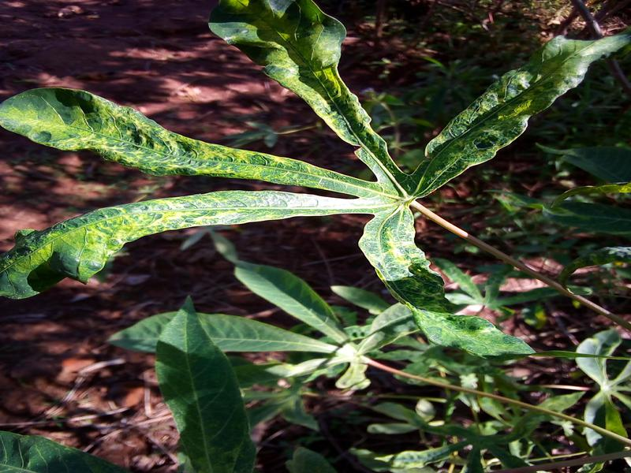

# Cassava_Plant_Disease_Classification
This repo for Cassava plant disease classification using Deep Learning (DL) approach froom kaggle competitions. 




## Classification Problem 

From the images provided, the goal is classify the images into: 

```
Cassava Bacterial Blight (CBB)
Cassava Brown Streak Disease (CBSD) 
Cassava Green Mottle (CGM)
Cassava Mosaic Disease (CMD)
Healthy
```

## Get Dataset
The following command is to get the images, labels, and classes from kaggle competition

```
kaggle competitions download -c cassava-leaf-disease-classification
```
Then, run the following command to unzip the file
```
unzip cassava-leaf-disease-classification.zip
```

You can see now the following Directories/Files: 
```
test_images
train_images 
train.csv
```

## Data Exploration 

Check the provided notebook. 


## Train and Evaluate Model

Run main.py file to train and evaluate the model using the below command: 

```
python main.py --batch_size 64 --epochs 10 --num_classes 5 --class_weights True --lr 0.000001 --gpu_number 1
```

